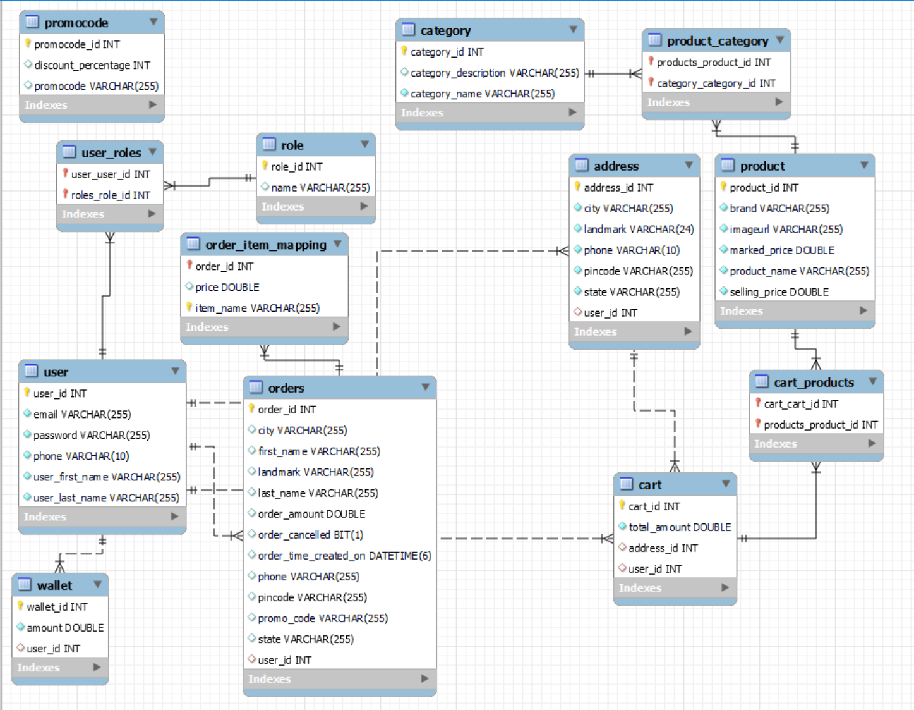

# E-commerce Rest API
This is a full-stack E-commerce web application built with Spring Boot, designed to allow users to browse, search, and purchase products online. The application includes a variety of features commonly found in e-commerce websites, including a user registration and login system, product search and filtering, shopping cart functionality, order management.

The backend of the application is built using Spring Boot, which provides a robust and scalable foundation for building RESTful APIs. The frontend of the application is built using HTML, CSS, and JavaScript.

This application has been architected with scalability, flexibility, and maintainability in mind. The codebase is well-organized and easy to navigate, with a clear separation of concerns between the frontend and backend components. The backend database is designed to support large-scale data storage, with the ability to easily add additional data fields and tables as needed.

Overall, this e-commerce application offers a user-friendly and seamless online shopping experience, powered by the latest technologies and best practices in web development.

## Contributing

This is an individual project that has been build by one person in a span of 1 month.

## Installation & Run

* Before running the API server, you should update the database config inside the application.properties file.

* Update the port number, username and password as per your local database configuration.

```
    server.port=5000

    spring.datasource.url=jdbc:mysql://localhost:3306/prd;
    spring.datasource.driver-class-name=com.mysql.cj.jdbc.Driver
    spring.datasource.username=root
    spring.datasource.password=root
```

## API Root Endpoint

#### Try it out online
```
http://ecommerceprd-env.eba-c83mgfz2.ap-northeast-1.elasticbeanstalk.com/swagger-ui/index.html
```

#### To use in local environment
```
https://localhost:5000/
```
```
http://localhost:5000/swagger-ui/index.html
```

## Services

- User Service
- Cart Service
- Product Service
- Promo Code Service
- Wallet Service
- Category Service

## ER Diagram




### Tech Stack
* Java
* Hibernate
* Spring Framework
* Spring Boot
* Spring Data JPA
* MySQL
* Maven
* Swagger UI
* BootStrap 5
